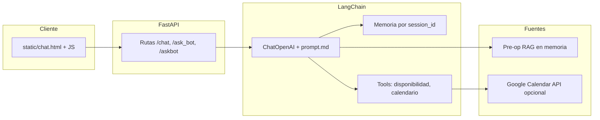
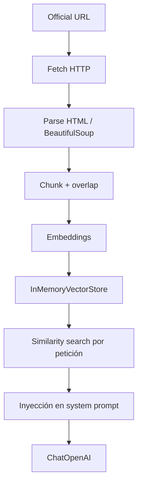

# Vet-es (enae-vet-es)

Chatbot y asistente de reservas para clínica veterinaria (caso final ENAE): orienta a citación, FAQs y procedimientos internos; **no diagnostica ni prescribe**.

**Enlaces rápidos:** [Repositorio GitHub — 2310-dot/vet-es](https://github.com/2310-dot/vet-es) · [Jira — resumen VE](https://eliuperez4.atlassian.net/jira/software/projects/VE/summary) · [Jira — issues / backlog](https://eliuperez4.atlassian.net/jira/software/projects/VE/issues) · [Vercel — panel del proyecto](https://vercel.com/2310-dots-projects/vet-es)

---

## Tabla de contenidos

1. [Visión general del proyecto](#visión-general-del-proyecto)
2. [Equipo y curso](#equipo-y-curso)
3. [Arquitectura y stack](#arquitectura-y-stack)
4. [Estructura del repositorio](#estructura-del-repositorio)
5. [Requisitos previos](#requisitos-previos)
6. [Instalación local](#instalación-local)
7. [Variables de entorno](#variables-de-entorno)
8. [Cómo ejecutar en local](#cómo-ejecutar-en-local)
9. [Despliegue en Vercel](#despliegue-en-vercel)
10. [Endpoints de la API](#endpoints-de-la-api)
11. [Funcionalidades y rúbrica del caso](#funcionalidades-y-rúbrica-del-caso)
12. [Documentación adicional](#documentación-adicional)
13. [Cómo probar y verificar](#cómo-probar-y-verificar)
14. [Backlog y trazabilidad Jira](#backlog-y-trazabilidad-jira)
15. [Notas de seguridad](#notas-de-seguridad)

---

## Visión general del proyecto

**MVP:** reducir fricción al agendar **esterilización / castración** en una clínica veterinaria: conversación → elección de día (sin hora quirúrgica para el cliente), reglas de capacidad y ventanas de ingreso, confirmación con ayuno y entrega.

Flujo de negocio (alineado con `docs/`):

1. Conversación → intención y datos necesarios.
2. Solo **día**; no se pide hora quirúrgica al cliente.
3. Reglas de capacidad: cuota **240 minutos** diarios, límite de perros, tiempos desde configuración o dominio.
4. Ventanas de ingreso: gatos 08:00–09:00; perros 09:00–10:30. Horarios quirúrgicos internos no se muestran al cliente.
5. Confirmación: ingreso + ayuno (última comida 8–12 h antes; agua hasta 1–2 h antes, según política).

---

## Equipo y curso

| Rol / área                            | Contacto / notas              |
| ------------------------------------- | ----------------------------- |
| Autor / mantenedor                    | Eliu Salvador Pérez Tantaleán |
| Curso / contexto académico            | ENAE — *Data Science e IA para la Toma de Decisiones* (caso clínica veterinaria) |
| Otros roles (PM, revisores, rotación) | **TBD por completar por el equipo** |

---

## Arquitectura y stack

| Tecnología           | Rol                                                                           |
| -------------------- | ----------------------------------------------------------------------------- |
| **Python**           | Servicios, APIs, cadenas/agentes LangChain.                                   |
| **LangChain**        | Prompts, herramientas (disponibilidad, calendario), RAG preoperatorio, memoria. |
| **FastAPI**          | Capa HTTP/API del bot.                                                        |
| **OpenAI**           | Modelo de chat vía `langchain-openai` (clave solo en entorno).                |
| **Canal / frontend** | Demo web estática (`static/chat.html` + JS) servida en `GET /`.               |
| **Vercel**           | Despliegue serverless (Git → producción / preview).                           |

Detalle de patrones (prompts, tools, RAG, memoria): [.cursor/skills/langchain-vet-chatbots/SKILL.md](.cursor/skills/langchain-vet-chatbots/SKILL.md), [.cursor/agents/backend-langchain-vet.md](.cursor/agents/backend-langchain-vet.md).



---

## Estructura del repositorio

```text
vet-es/
├── main.py                 # FastAPI: rutas, CORS, estáticos
├── llm_service.py          # Orquestación LLM, RAG, tools
├── conversation_memory.py  # Memoria en proceso por sesión
├── prompt.md               # System prompt operativo
├── google_calendar_tool.py # Lectura Calendar API (VE-24 / VE-30)
├── preop_rag/              # Ingesta HTML, chunks, índice vectorial en memoria
├── tools/                  # p. ej. check_surgical_availability (VE-29 / VE-30)
├── static/                 # Demo chat (VE-19)
├── public/                 # Archivos públicos bajo GET /public/ (VE-25)
├── scripts/                # p. ej. OAuth refresh token
├── tests/                  # pytest
├── docs/                   # Reglas de negocio, aceptación, Jira exports, evidencias
├── api/                    # Entrada Vercel → app
├── .env.example            # Plantilla de variables (no secretos reales)
└── vercel.json             # Configuración de despliegue
```

---

## Requisitos previos

- **Python 3** compatible con `requirements.txt`.
- Cuenta OpenAI y clave para ejecutar el chat en condiciones reales (o modo fake embeddings para RAG en desarrollo; ver [.env.example](.env.example)).
- Opcional: proyecto Google Cloud + OAuth para `list_google_calendar_events` y modo Google de disponibilidad (VE-24 / VE-30).

---

## Instalación local

```bash
python -m venv .venv
```

Activa el entorno virtual:

- **Windows (PowerShell):** `.venv\Scripts\Activate.ps1`
- **Linux / macOS:** `source .venv/bin/activate`

```bash
python -m pip install -r requirements.txt
```

Tests (opcional): `python -m pip install -r requirements-dev.txt` y luego `pytest`.

---

## Variables de entorno

Referencia canónica: [.env.example](.env.example). No subir `.env` al repositorio; en Vercel, solo el panel de variables.

| Variable | Obligatoria | Descripción | Ejemplo (sin valores reales) |
| -------- | ----------- | ----------- | ---------------------------- |
| `OPENAI_API_KEY` | Sí, para respuestas LLM en `/chat`, `/ask_bot`, `/askbot` | Clave API OpenAI | `sk-proj-…` (ver plantilla en `.env.example`) |
| `OPENAI_CHAT_MODEL` | No | Modelo de chat | `gpt-4o-mini` |
| `LLM_DEBUG_ERRORS` | No | Solo depuración local; no producción | `0` |
| `PORT` | No | Puerto local Uvicorn | `8000` |
| `FRONTEND_URL` | No | Origen documentado para CORS / front | `http://localhost:3000` |
| `CORS_ALLOW_ORIGINS` | No | Lista separada por comas; si vacía, CORS extra desactivado | `http://127.0.0.1:5500,http://localhost:5500` |
| `RAG_SOURCE_URL` | No | Placeholder genérico en plantilla; el RAG preoperatorio usa URL fijada en código | `https://example.invalid/...` |
| `PREOP_RAG_LIVE_URL` | No | Override de URL para pruebas; por defecto `OFFICIAL_PREOP_DOC_URL` en código | Ver comentario en `.env.example` |
| `PREOP_RAG_FAKE_EMBEDDINGS` | No | `1` = embeddings deterministas sin llamar OpenAI para índice | `1` |
| `RUN_PREOP_RAG_LIVE` | No | Solo para pytest con red | `1` |
| `CLINIC_PHONE` / `CLINIC_EMAIL` | No | Inyección opcional en system prompt | *(vacío)* |
| `CHAT_MEMORY_MAX_TURNS` | No | Máx. pares usuario→asistente por sesión | `50` |
| `CHAT_MEMORY_TTL_SECONDS` | No | TTL de sesión en memoria; `0` = sin TTL por tiempo | `0` |
| `GOOGLE_CALENDAR_ID` | Condicional (Google en vivo) | Calendario a consultar | `primary` |
| `GOOGLE_CALENDAR_CLIENT_ID` | Condicional | OAuth client ID | *(ver consola Google)* |
| `GOOGLE_CALENDAR_CLIENT_SECRET` | Condicional | OAuth client secret | *(ver consola Google)* |
| `GOOGLE_CALENDAR_REFRESH_TOKEN` | Condicional | Token obtenido con `scripts/get_google_token.py` | *(no commitear)* |
| `GOOGLE_CALENDAR_HTTP_TIMEOUT_SECONDS` | No | Timeout HTTP API Calendar | `30` |
| `GOOGLE_CALENDAR_USE_STUB` | No | `1` / `true` = stub y mock de disponibilidad sin Google | `0` |

**Demo en navegador (VE-19):** el HTML no lee `.env`. La base del API en el cliente está en `static/chat_config.js` → `window.CHATBOT_API_BASE` (`""` = mismo origen).

**Memoria de sesión (VE-21):** el `session_id` viaja en el cuerpo (`POST /chat` JSON; `/ask_bot` y `/askbot` form o JSON). La demo guarda un UUID en `sessionStorage` ([static/chat.js](static/chat.js)). Claves **sensibles a mayúsculas**; sin persistencia en disco (reinicio del proceso borra el historial).

---

## Cómo ejecutar en local

```bash
python -m uvicorn main:app --reload
```

- Documentación interactiva: [http://127.0.0.1:8000/docs](http://127.0.0.1:8000/docs)
- OpenAPI: [http://127.0.0.1:8000/openapi.json](http://127.0.0.1:8000/openapi.json)
- Demo chat: [http://127.0.0.1:8000/](http://127.0.0.1:8000/)

Con `OPENAI_API_KEY` y `prompt.md`, las rutas de chat devuelven texto del modelo (`placeholder: false`). Sin clave: **503**. Fallo proveedor: **502**. Errores de validación (`422` / `415`) no escriben en memoria.

---

## Despliegue en Vercel

El proyecto se despliega en **Vercel** al hacer push o merge a `main`. Cada PR genera un **deployment preview** con su propia URL (`*.vercel.app` o dominio custom).

- **UI de chat en producción o preview:** URL pública del deployment, ruta `/` (misma app FastAPI que en local).
- **Variables:** solo en Vercel (`Settings → Environment Variables`). Para local, copia `.env.example` a `.env`.
- **Origen distinto al API:** configurar `CORS_ALLOW_ORIGINS` en Vercel (lista separada por comas).

---

## Endpoints de la API

| Método | Ruta | Propósito |
| ------ | ---- | --------- |
| `GET` | `/` | HTML del demo de chat (`static/chat.html`). |
| `GET` | `/health` | *Liveness* JSON (`{"status":"ok"}`). |
| `GET` | `/static/...` | Ficheros estáticos (CSS/JS). |
| `GET` | `/public/{path}` | Ficheros bajo `public/` con saneamiento de ruta (VE-25). |
| `POST` | `/chat` | JSON `{"msg","session_id"}` → respuesta asistente + `turn_count`. |
| `POST` | `/ask_bot` | `application/x-www-form-urlencoded` con `msg`, `session_id`. |
| `POST` | `/askbot` | JSON o form urlencoded (VE-25); mismos campos. |

Ejemplo rápido (puerto 8000):

```bash
curl -s http://127.0.0.1:8000/health

curl -s -X POST http://127.0.0.1:8000/chat \
  -H "Content-Type: application/json" \
  -d "{\"msg\": \"¿En qué horario abren?\", \"session_id\": \"demo-curl\"}"
```

Cuerpo de respuesta típico: `msg`, `session_id`, `placeholder`, `turn_count`.

---

## Funcionalidades y rúbrica del caso

### Base (memoria + system prompt + dominio)

- **Memoria:** `conversation_memory` + `session_id` en las rutas de chat (VE-21); límite por turnos `CHAT_MEMORY_MAX_TURNS`.
- **System prompt:** cargado desde [prompt.md](prompt.md); puntero en código: `SYSTEM_PROMPT_SOURCE_REF` en [llm_service.py](llm_service.py).
- **Dominio:** esterilización/castración, ventanas de ingreso, límites de alcance (sin diagnóstico clínico).

### RAG preoperatorio (VET-11, VE-22, VE-28)

Fuente obligatoria del caso (inglés), fijada en código:

| Referencia | Valor |
| ---------- | ----- |
| Constante | `OFFICIAL_PREOP_DOC_URL` en [preop_rag/config.py](preop_rag/config.py) |
| URL | [https://veterinary-clinic-teal.vercel.app/en/docs/instructions-before-operation](https://veterinary-clinic-teal.vercel.app/en/docs/instructions-before-operation) |

Resolución efectiva: `_resolve_source_url()` en [preop_rag/runtime.py](preop_rag/runtime.py) usa `PREOP_RAG_LIVE_URL` si está definida; **si no**, la URL anterior. El HTML descargado de esa URL se trocea; cada chunk conserva `metadata["source"]` igual a la URL indexada ([preop_rag/extract.py](preop_rag/extract.py), comprobado en [tests/test_preop_pipeline.py](tests/test_preop_pipeline.py)).

Al arrancar, `load_preop_rag_index()` construye un `InMemoryVectorStore`; en cada turno de chat, [llm_service.py](llm_service.py) llama a `retrieve_top_k()` y, si hay *hits*, añade al *system prompt* el bloque delimitado por `--- Retrieved pre-operative reference excerpts ---` … `--- End excerpts ---` (véase `invoke_chat_llm`).

**Compatibilidad prompt + RAG (rúbrica):** En [docs/conversaciones-aceptacion-chatbot.md](docs/conversaciones-aceptacion-chatbot.md) se indica que el mismo dato puede vivir en `prompt.md`, en fragmentos recuperados o en ambos. **Que la respuesta sobre ayuno coincida con el prompt no invalida el +1 RAG (VET-11)** si queda demostrado el pipeline (ingesta desde la URL oficial, índice y recuperación que alimentan al modelo).



#### VET-11 (+1 RAG): evidencia

1. **Ingesta desde la URL oficial** — Índice construido con el HTML de la URL efectiva (`OFFICIAL_PREOP_DOC_URL` salvo `PREOP_RAG_LIVE_URL`; documentado en [`.env.example`](.env.example)). Tras un indexado exitoso, `load_preop_rag_index()` asigna `_indexed_source_url` a esa URL antes del log `Pre-op RAG index ready` ([preop_rag/runtime.py](preop_rag/runtime.py)).
2. **Retriever observable (qué mirar en el código y en runtime)**  
   - **Arranque:** log `INFO` del logger `preop_rag.runtime`: `Pre-op RAG index ready (source=<URL>, chunks=N, fake_embeddings=…)` — el `<URL>` debe ser la indexada (oficial u override).  
   - **Introspección:** `get_indexed_preop_source_url()` devuelve esa URL tras un arranque correcto; los tests `tests/test_preop_runtime.py` y `tests/test_preop_live.py` aserten que coincide con `OFFICIAL_PREOP_DOC_URL` cuando no hay override.  
   - **Por petición:** el código **no** escribe un log `INFO` en cada `similarity_search` exitoso; la traza observable por turno es el **contenido del `SystemMessage`** enviado al modelo: si hay documentos recuperados, incluye el marcador `Retrieved pre-operative reference excerpts` y los `[Excerpt n]` ([llm_service.py](llm_service.py)). Eso puede comprobarse con depurador, *logging* temporal o el test `test_invoke_chat_llm_appends_preop_excerpts_when_index_loaded` en [tests/test_llm_service.py](tests/test_llm_service.py).  
   - **Fallo de recuperación:** solo entonces se registra excepción (`Pre-op RAG retrieval failed; continuing without excerpts`).
3. **Pruebas automáticas** — `pytest tests/test_preop_config.py` (URL esperada); `tests/test_preop_pipeline.py` (`metadata["source"]` y `retrieve_top_k`); `tests/test_preop_runtime.py` (URL indexada sin override). Con red: `RUN_PREOP_RAG_LIVE=1 pytest -m preop_live`.
4. **Demo CLI** — `python -m preop_rag.demo` imprime en *stderr* `source_url=...`.

**Config / variables / errores:** chunking y `TOP_K_RESULTS` en `preop_rag/config.py`; `PREOP_RAG_FAKE_EMBEDDINGS=1` para índice sin embeddings OpenAI; si la URL no responde, mensaje fijado: *«No se pudo acceder a la fuente de información preoperatoria. Por favor, inténtalo de nuevo.»*

**Conv. 10 (inglés)** — Con RAG activo (`OPENAI_API_KEY` o `PREOP_RAG_FAKE_EMBEDDINGS=1` con fetch OK). Puedes validar coherencia con la página oficial **y** comprobar en depuración que el *system prompt* lleva el bloque de excerpts; **no** es requisito que la redacción final difiera de `prompt.md` si el retriever está probado como arriba.

| Turno | Qué comprobar |
| ----- | ------------- |
| 1 | «How long should my dog fast before the operation?» → ventana de ayuno acorde al doc. |
| 2 | «Can he drink water right up until we leave home?» → política de agua coherente con el doc. |

```bash
curl -s -X POST http://127.0.0.1:8000/chat -H "Content-Type: application/json" \
  -d "{\"msg\": \"How long should my dog fast before the operation?\", \"session_id\": \"accept-rag-10a\"}"

curl -s -X POST http://127.0.0.1:8000/chat -H "Content-Type: application/json" \
  -d "{\"msg\": \"Can he drink water right up until we leave home?\", \"session_id\": \"accept-rag-10a\"}"
```

**Preguntas manuales (español)** y más `curl`: ver tabla en [docs/conversaciones-aceptacion-chatbot.md](docs/conversaciones-aceptacion-chatbot.md) (mismo pipeline).

### Tool de disponibilidad (VET-12 / VET-13, VE-29 / VE-30)

El modelo enlaza **`check_surgical_availability`**: capacidad orientativa por día (`YYYY-MM-DD`). Resultados **orientativos**; no confirman reserva ni calendario real del cliente (ver `prompt.md`). Implementación: [tools/availability.py](tools/availability.py).

| Modo | Condición | `source` |
| ---- | --------- | -------- |
| Google Calendar (VE-30) | Env OAuth completo y `GOOGLE_CALENDAR_USE_STUB` no truthy | `"google_calendar"` |
| Mock (VE-29) | Stub, fin de semana, fecha inválida o error | `"mock"` |

Mock: cuota 240 min; lun/mié 60 min libres; mar/jue 120; vie 180; fin de semana no disponible; `dogs_remaining` / `cats_remaining` numéricos. Modo Google: mismos campos de minutos restantes aproximados por eventos; `dogs_remaining` / `cats_remaining` en `null`.

**Tests:** `pytest tests/test_availability.py -v`

**OAuth (reproducible):** Google Cloud → Calendar API → OAuth *Desktop app* → `python scripts/get_google_token.py path/to/client_secret….json` → copiar variables a `.env` según [.env.example](.env.example). Evidencia de llamada en vivo: [docs/evidence/](docs/evidence/) (ver [docs/evidence/README.md](docs/evidence/README.md)).

**`list_google_calendar_events` (VE-24):** [google_calendar_tool.py](google_calendar_tool.py); mismo bloque de variables. Uso interno; no sustituye reglas Tetris en `docs/` ni expone horarios quirúrgicos internos al cliente.

**Límite (Calendar frente a reglas del caso):**

| Regla de negocio | ¿Cubierta por Google Calendar? | Cómo se gestiona aquí |
| ---------------- | ------------------------------ | --------------------- |
| Cuota 240 min / día | No nativa | Se aproxima sumando duraciones de eventos del día en la herramienta. |
| Límite de perros por día | No | En modo Google, `dogs_remaining` es `null` (no inferido del calendario). |
| Ventanas de ingreso (gatos / perros) | No | Se devuelven como texto fijo en `intake_windows`; no se validan contra eventos. |
| Horarios quirúrgicos internos | No expuestos | La herramienta es orientativa; no sustituye confirmación humana. |
| Otras reglas (celo, etc.) | No | Ver [docs/reglas-de-negocio-logica-de-agenda.md](docs/reglas-de-negocio-logica-de-agenda.md) y [docs/event-storming-workflow.md](docs/event-storming-workflow.md). |

### Catálogo de intents

Los intents alineados con las 10 conversaciones de aceptación están descritos por conversación en [docs/conversaciones-aceptacion-chatbot.md](docs/conversaciones-aceptacion-chatbot.md) (VET-5 / evidencia de +1 pt intents).

### Rúbrica del caso → implementación

| Punto del caso | Cubierto por | Evidencia |
| -------------- | ------------ | --------- |
| Base: memoria + dominio + prompt | `conversation_memory`, `prompt.md`, rutas chat | Conv. 1–7 en `docs/conversaciones-aceptacion-chatbot.md`; tests memoria/LLM según `tests/` |
| + Vercel | Despliegue | Panel [2310-dots-projects/vet-es](https://vercel.com/2310-dots-projects/vet-es); `vercel.json`, `api/` |
| + Jira | Gestión backlog | [Proyecto VE](https://eliuperez4.atlassian.net/jira/software/projects/VE/issues) |
| + RAG (URL oficial) | `preop_rag/` + `llm_service` | URL oficial en código + índice + recuperación al prompt; tests preop + `test_llm_service`; conv. 10 (la respuesta puede solaparse con `prompt.md`, véase doc de conversaciones) |
| + Tool disponibilidad | `tools/availability.py`, Calendar opcional | Conv. 8–9; `tests/test_availability.py` |
| + Intents documentados | Documentación | `docs/conversaciones-aceptacion-chatbot.md` |

---

## Documentación adicional

| Recurso | Descripción |
| ------- | ----------- |
| [CLAUDE.md](CLAUDE.md) | Guía para asistentes de código en el repo |
| [docs/event-storming-workflow.md](docs/event-storming-workflow.md) | Flujo de reserva y capacidad (Mermaid) |
| [docs/reglas-de-negocio-logica-de-agenda.md](docs/reglas-de-negocio-logica-de-agenda.md) | Reglas de agenda |
| [docs/consideraciones-preoperatorias-clinica.md](docs/consideraciones-preoperatorias-clinica.md) | Consideraciones preoperatorias (ES) |
| [docs/conversaciones-aceptacion-chatbot.md](docs/conversaciones-aceptacion-chatbot.md) | Guiones de aceptación e intents |
| [docs/jira/](docs/jira/) | Exports de tickets enriquecidos |
| [docs/SDD_PROJECT_RULES.md](docs/SDD_PROJECT_RULES.md) | Reglas SDD del proyecto |
| [.cursor/commands/implement.md](.cursor/commands/implement.md) | Flujo ticket Jira → PR |
| [.cursor/commands/enrich.md](.cursor/commands/enrich.md) | Flujo de enriquecimiento de tickets |

**Consistencia:** al cambiar reglas en `docs/`, actualizar este README si afecta a comportamiento descrito (capacidad, ventanas, mensajes).

---

## Cómo probar y verificar

1. **Automatizado:** `pytest` (con venv y `requirements-dev.txt` si aplica).
2. **Conversaciones de aceptación:** seguir [docs/conversaciones-aceptacion-chatbot.md](docs/conversaciones-aceptacion-chatbot.md) (orden conv. 1–7 base; 8–9 tool; 10 RAG).
3. **RAG:** con servidor en marcha y RAG activo (`OPENAI_API_KEY` o `PREOP_RAG_FAKE_EMBEDDINGS=1` con fetch OK), usar los ejemplos `curl` de la conv. 10 en ese documento o preguntas en español del mismo guion. Para evidencia del retriever, revisar log de arranque, `get_indexed_preop_source_url()` o el bloque de excerpts en el *system message* (no hay log INFO por cada búsqueda exitosa).
4. **Disponibilidad:** mensaje de chat que dispare la tool o logs `[tool] check_surgical_availability` en [tools/availability.py](tools/availability.py); con Google en vivo, trazas hacia `calendar.googleapis.com` en [google_calendar_tool.py](google_calendar_tool.py).

---

## Backlog y trazabilidad Jira

- [Issues del proyecto VE](https://eliuperez4.atlassian.net/jira/software/projects/VE/issues)
- [Resumen del proyecto](https://eliuperez4.atlassian.net/jira/software/projects/VE/summary)

**Mapeo rápido (tickets Doc / curso → secciones de este README):**

| Ticket / tema | Sección / evidencia en repo |
| ------------- | --------------------------- |
| VET-3 | [Despliegue en Vercel](#despliegue-en-vercel) |
| VET-4 | Esta sección + enlaces Jira |
| VET-5 | [Catálogo de intents](#catálogo-de-intents) |
| VET-11 | [RAG preoperatorio](#rag-preoperatorio-vet-11-ve-22-ve-28) |
| VET-12 / VET-13 | [Tool de disponibilidad](#tool-de-disponibilidad-vet-12--vet-13-ve-29--ve-30) |
| VET-14 + base | [Funcionalidades y rúbrica](#funcionalidades-y-rúbrica-del-caso), `docs/conversaciones-aceptacion-chatbot.md` |

Planificación de producto a alto nivel no gestionada aquí: **TBD por completar por el equipo** (p. ej. épica o Confluence cuando exista).

---

## Notas de seguridad

- Claves API, secretos OAuth y tokens solo en **`.env` local** o **variables del panel Vercel**; nunca en el repositorio ni en el frontend.
- El cliente de demo solo envía `msg` y `session_id`; no almacena la clave OpenAI.
