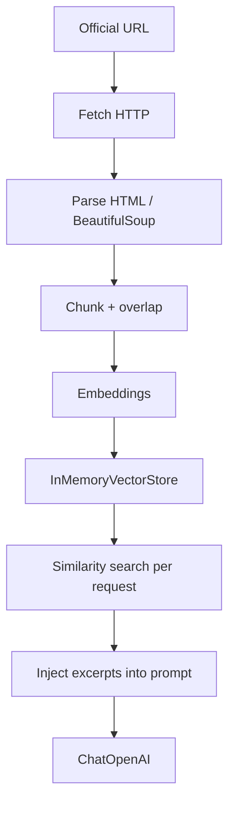

# Vet-es (enae-vet-es)

**Punto único de entrada** al repositorio: contexto del producto, enlaces operativos (Jira, código), cómo levantar el entorno local y dónde profundizar. Lee primero las secciones **Proyecto → Jira → Setup local** (unos minutos); el resto sirve para reglas de negocio, API y flujos de trabajo en Cursor.

**Repositorio en GitHub:** [2310-dot/vet-es](https://github.com/2310-dot/vet-es)

---

## Proyecto

Chatbot y asistente de reservas para clínica veterinaria (caso ENAE). El backend previsto es **Python**, **LangChain** / LangGraph, **FastAPI**; el bot no diagnostica ni prescribe: orienta a citación, FAQs y procedimientos internos, citando herramientas o documentos recuperados.


| Tecnología           | Rol                                                                           |
| -------------------- | ----------------------------------------------------------------------------- |
| **Python**           | Servicios, APIs, cadenas/agentes LangChain.                                   |
| **LangChain**        | Prompts, herramientas (citas, paciente, etc.), RAG sobre protocolos, memoria. |
| **FastAPI**          | Capa HTTP/API del bot.                                                        |
| **Canal / frontend** | Demo web estática (`static/chat.html` + JS) servida por FastAPI en `GET /`.   |


Detalle de implementación: [.cursor/skills/langchain-vet-chatbots/SKILL.md](.cursor/skills/langchain-vet-chatbots/SKILL.md), [.cursor/agents/backend-langchain-vet.md](.cursor/agents/backend-langchain-vet.md).

---

## Equipo


| Rol / área                            | Contacto / notas              |
| ------------------------------------- | ----------------------------- |
| Autor / mantenedor                    | Eliu Salvador Pérez Tantaleán |
| Otros roles (PM, revisores, rotación) | **TBD**                       |


---

## Jira

Proyecto **Vet-es** en Atlassian (enlaces clicables):

- [Resumen del proyecto VE](https://eliuperez4.atlassian.net/jira/software/projects/VE/summary)
- [Lista de issues / backlog](https://eliuperez4.atlassian.net/jira/software/projects/VE/issues)

---

## Setup local

Requisitos: **Python 3** compatible con las dependencias de `requirements.txt`.

```bash
python -m venv .venv
```

Activa el entorno virtual:

- **Windows (PowerShell):** `.venv\Scripts\Activate.ps1`
- **Linux / macOS:** `source .venv/bin/activate`

Instala dependencias y arranca la API (`main.py`):

```bash
python -m pip install -r requirements.txt
python -m uvicorn main:app --reload
```

**Cliente LLM (backend):** las dependencias OpenAI vía LangChain están en `requirements.txt` (`langchain-openai`, `langchain-core`, etc.). La clave **solo** se obtiene del entorno (`OPENAI_API_KEY`); ver `.env.example` y [llm_service.py](llm_service.py).

- Documentación interactiva: [http://127.0.0.1:8000/docs](http://127.0.0.1:8000/docs)
- OpenAPI: [http://127.0.0.1:8000/openapi.json](http://127.0.0.1:8000/openapi.json)
- API rápida: `GET /health` (JSON), `POST /chat` (JSON `msg` + `session_id`), `POST /ask_bot` (form urlencoded), `POST /askbot` (JSON o form).

**Demo de chat en el navegador (VE-19):**

- **Local:** con `uvicorn` en marcha, abre la raíz del API en el navegador, p. ej. [http://127.0.0.1:8000/](http://127.0.0.1:8000/) (o el puerto que uses). Escribe un mensaje y pulsa **Send**; la UI hace `POST /chat` con JSON (`msg`, `session_id`). Si la petición falla (red, CORS, 4xx/5xx), verás un mensaje en el banner rojo encima del historial.
- **URL base del API (solo front):** edita `static/chat_config.js` y asigna `window.CHATBOT_API_BASE`. Cadena vacía `""` = mismo origen que la página (caso típico local). Para otro backend, p. ej. `"https://tu-app.vercel.app"` (sin barra final). No hay lógica de negocio en el cliente más allá de enviar el mensaje y mostrar la respuesta.
- **Despliegue (Vercel):** abre la **URL pública** del proyecto (raíz `/`), la misma que muestra el dashboard de Vercel como dominio de producción o preview — no el enlace al panel de Vercel. Ahí se sirve el mismo HTML; si sirves la UI desde otro origen que el de la API, configura `CORS_ALLOW_ORIGINS` en Vercel (lista separada por comas; ver `.env.example`).

**Propagación de `session_id` (memoria por sesión, VE-27):**

- **Mecanismo documentado en este repo:** el identificador viaja en el **cuerpo de la petición** (no cabecera `X-Session-ID`, ni cookie, ni query en el servidor).
  - `POST /chat`: JSON `{"msg": "...", "session_id": "..."}` (`Content-Type: application/json`).
  - `POST /ask_bot`: `application/x-www-form-urlencoded` con campos `msg` y `session_id`.
  - `POST /askbot`: el mismo par en JSON o en formulario urlencoded (VE-25).
- **Demo en navegador:** [static/chat.js](static/chat.js) obtiene o crea un UUID y lo guarda en `sessionStorage` bajo la clave `vet-es-chat-session-id` (una conversación por pestaña; datos de ejemplo, no persistidos en servidor salvo el buffer en memoria del proceso).
- **Límite de contexto:** el backend **no** aplica un tope fijo de tokens al historial; recorta por **turnos** completos (pares usuario→asistente) con `CHAT_MEMORY_MAX_TURNS` (por defecto `50`). Ver tabla en [Variables de entorno → Session memory](#session-memory-ve-21--english).

**Tests (opcional):** con el venv activo, `python -m pip install -r requirements-dev.txt` si aplica, luego `pytest`.

### Pre-op RAG (VE-22, integración VE-28)

La fuente obligatoria es la página oficial en inglés (valor fijado en `preop_rag/config.py` como `OFFICIAL_PREOP_DOC_URL`); no se sustituye por un PDF genérico. Al arrancar FastAPI (`main.py`), se descarga esa URL, se extrae texto útil, se trocea, se generan embeddings y se construye un **vector store en memoria**; en cada `POST /chat`, `POST /ask_bot` y `POST /askbot` se recuperan los fragmentos más similares a la pregunta y se añaden al *system prompt* bajo el bloque `--- Retrieved pre-operative reference excerpts ---`.



- **Config** (chunk size, overlap, `TOP_K_RESULTS`, embedding model, source URL, `PREOP_RAG_CONFIG_VERSION`): `preop_rag/config.py`.
- **Variables:** `PREOP_RAG_LIVE_URL` (solo override opcional), `PREOP_RAG_FAKE_EMBEDDINGS=1` para índice local sin `OPENAI_API_KEY` (desarrollo / pruebas). Sin clave y sin *fake*, el chat sigue funcionando **sin** RAG.
- **Errores:** si la URL no responde, las preguntas que parecen de preoperatorio devuelven el texto fijado en código: *«No se pudo acceder a la fuente de información preoperatoria. Por favor, inténtalo de nuevo.»* El resto de temas siguen con el LLM sin fragmentos recuperados.
- **Demo local (solo pipeline):** `python -m preop_rag.demo` (con clave) o `python -m preop_rag.demo --fake-embeddings`.
- **Tests:** `pytest` — *fixtures* HTML + vector store en memoria (`tests/test_preop_*.py`). Opcional con red: `RUN_PREOP_RAG_LIVE=1 pytest -m preop_live`. La salida de `pytest` en CI o local sirve como **evidencia** de verificación (VE-28).

**Preguntas de prueba manual** (servidor en marcha, `OPENAI_API_KEY` y red; la respuesta debe basarse en el contenido recuperado de la URL oficial, no inventada):

| # | Pregunta (resumen) | Qué comprobar en la respuesta |
| --- | --- | --- |
| 1 | Ayuno antes de operación | Menciona ayuno en horas coherente con la página (p. ej. ventana 8–12 h o la redacción del doc). |
| 2 | Noche anterior / preparación | Instrucciones alineadas con el doc (descanso, llegada, documentación, etc.). |
| 3 | Agua antes de la cirugía | Política de agua acorde al doc (p. ej. hasta 1–2 h antes si así figura). |

```bash
# 1 — Ayuno
curl -X POST http://127.0.0.1:8000/chat \
  -H "Content-Type: application/json" \
  -d "{\"msg\": \"¿Cuántas horas debe estar mi mascota en ayuno antes de la operación?\", \"session_id\": \"test-rag-1\"}"

# 2 — Preparación previa
curl -X POST http://127.0.0.1:8000/chat \
  -H "Content-Type: application/json" \
  -d "{\"msg\": \"¿Qué debo hacer la noche anterior a la cirugía?\", \"session_id\": \"test-rag-2\"}"

# 3 — Agua
curl -X POST http://127.0.0.1:8000/chat \
  -H "Content-Type: application/json" \
  -d "{\"msg\": \"¿Puede beber agua mi perro antes de la operación?\", \"session_id\": \"test-rag-3\"}"
```

---

## Variables de entorno

Opcionales: el API arranca sin `.env`. Ver `.env.example` (OpenAI, CORS, RAG, memoria de chat).

### Session memory (VE-21) — English

In-process conversation store keyed by **trimmed** `session_id` (**case-sensitive**; `"A"` and `"a"` are different). `POST /chat`, `POST /ask_bot`, and `POST /askbot` share this store. Data is **not** persisted: a process restart clears everything. There is **no separate token budget** for history: trimming is by **stored turns** only (`CHAT_MEMORY_MAX_TURNS`).

| Variable | Default | Meaning |
| -------- | ------- | ------- |
| `CHAT_MEMORY_MAX_TURNS` | `50` | Max stored **user→assistant pairs** per session; oldest pairs dropped. |
| `CHAT_MEMORY_TTL_SECONDS` | `0` | If `0`, TTL is off (entries last until restart). If positive, a session with no activity for that many seconds (monotonic clock) is treated as empty on the next access. |

Concurrency: a single **`threading.Lock`** protects the store. Concurrent requests for the same session are serialized; under the lock, updates apply in order (**last write wins** for the stored transcript state after each completed handler).

Validation failures (`422` / `415` on `/chat`, `/ask_bot`, or `/askbot`) do **not** append to memory.

### LLM (OpenAI, `prompt.md`)

- **`OPENAI_API_KEY`**: obligatoria para que `POST /chat`, `POST /ask_bot` y `POST /askbot` llamen al modelo. Sin ella, esas rutas responden **503** con un mensaje claro (nunca en código ni en el front; ver `.env.example`).
- **`OPENAI_CHAT_MODEL`** (opcional): modelo de chat OpenAI; por defecto `gpt-4o-mini` en `llm_service.py`.
- **System prompt:** el texto operativo se carga desde **`prompt.md`** (raíz del repo, junto a `main.py`). En código, el puntero breve al prompt avanzado del caso ENAE y a ese archivo está en **`SYSTEM_PROMPT_SOURCE_REF`** en [llm_service.py](llm_service.py) (no se pega el prompt largo en Python).

Otras variables (CORS, puerto, RAG, etc.) siguen en `.env.example`.

### Orientative surgical availability (`check_surgical_availability`, VE-29)

The chat model binds **`check_surgical_availability`**: a **mock** read-model for theatre capacity by date (`YYYY-MM-DD`). It is **not** a real calendar; responses always include `"source": "mock"`. The agent must treat results as **orientative** only (see `prompt.md`).

**Python module:** [tools/availability.py](tools/availability.py) — pure function `check_availability(date: str) -> dict` plus the LangChain `StructuredTool`.

**What the mock simulates (fixed fiction, VE-29):**

| Rule | Mock value |
| --- | --- |
| Daily theatre quota | 240 minutes total |
| Monday & Wednesday | Higher load — **60** minutes remaining |
| Tuesday & Thursday | Medium — **120** minutes remaining |
| Friday | Lighter — **180** minutes remaining |
| Weekend | No surgical activity (`available: false`) |
| Dog slots per day | Max **3** (`dogs_remaining` is free capacity) |
| Cat slots per day | Max **4** (`cats_remaining` is free capacity) |

**JSON schema (documented for tooling and logs):**

- **Weekday with capacity** (`available: true`): `date`, `weekday` (English), `available`, `slots_remaining_minutes`, `dogs_remaining`, `cats_remaining`, `intake_windows` (`cats`, `dogs`, Unicode en-dash as in the ticket), `source`, `note`.
- **Weekend or invalid date** (`available: false`): `date`, `weekday` when the date parses, `available`, `reason`, `source`. Invalid ISO dates omit `weekday` and use a clear `reason` (no Python exception from the tool).

**Example `curl` (agent may call the tool when answering):**

```bash
curl -X POST http://127.0.0.1:8000/chat \
  -H "Content-Type: application/json" \
  -d "{\"msg\": \"¿Hay disponibilidad para operar a mi gato el próximo martes?\", \"session_id\": \"test-tool-1\"}"
```

**Expected server log (operator):** lines like `[tool] check_surgical_availability called with date="..."` and a compact `[tool] Response: {...}` from [tools/availability.py](tools/availability.py).

**Unit tests (no server):** `pytest tests/test_availability.py -v`

### Google Calendar tool (VE-24)

The chat model can call **`list_google_calendar_events`** (read-only) against **Google Calendar API** when credentials are set. This is **staff-side** infrastructure: it does not replace Tetris / capacity rules in `docs/` and must not be used to expose **internal surgical times** to clients (see `docs/event-storming-workflow.md` and `docs/reglas-de-negocio-logica-de-agenda.md`).

| Variable | Meaning |
| -------- | ------- |
| `GOOGLE_CALENDAR_ID` | Calendar to query (e.g. `primary` or a calendar ID). |
| `GOOGLE_CALENDAR_CLIENT_ID` | OAuth client ID (Desktop app in Google Cloud Console). |
| `GOOGLE_CALENDAR_CLIENT_SECRET` | OAuth client secret. |
| `GOOGLE_CALENDAR_REFRESH_TOKEN` | OAuth refresh token (from a one-time local OAuth flow). |
| `GOOGLE_CALENDAR_HTTP_TIMEOUT_SECONDS` | Optional timeout for API HTTP calls (default `30`). |
| `GOOGLE_CALENDAR_USE_STUB` | If `1` / `true`, the tool skips Google and returns an empty success payload (for CI / local without creds). **Default:** live API when unset and env is complete. |

**OAuth scope (minimal):** `https://www.googleapis.com/auth/calendar.readonly` — listed here and in code so reviewers can confirm least privilege.

**Manual check (AC7):** Configure env (no secrets in git), run the API, send a chat message that should trigger a calendar lookup (e.g. ask what is on the calendar in a window you seeded in the test calendar), or call the tool from a short Python snippet using the same `list_google_calendar_events_impl` as production.

---

## Backlog / roadmap

Seguimiento del trabajo en Jira:

- [Issues del proyecto VE](https://eliuperez4.atlassian.net/jira/software/projects/VE/issues)

Roadmap de producto a alto nivel: **TBD** (p.ej. enlace a Confluence o épica cuando exista).

---

## Enlaces relevantes.


| Recurso                                                                      | Descripción                                |
| ---------------------------------------------------------------------------- | ------------------------------------------ |
| [Repositorio GitHub](https://github.com/2310-dot/vet-es)                     | Código fuente                              |
| [CLAUDE.md](CLAUDE.md)                                                       | Guía para asistentes de código en el repo  |
| [docs/event-storming-workflow.md](docs/event-storming-workflow.md)           | Flujo de reserva y reglas de capacidad     |
| [docs/pre-operative-considerations.md](docs/pre-operative-considerations.md) | Consideraciones preoperatorias (ES)        |
| [docs/jira/](docs/jira/)                                                     | Exports de tickets enriquecidos (ejemplos) |
| [.cursor/commands/implement.md](.cursor/commands/implement.md)               | Flujo ticket Jira → PR                     |
| [.cursor/commands/enrich.md](.cursor/commands/enrich.md)                     | Flujo de enriquecimiento de tickets        |


---

## Workflow (negocio)

Flujo principal de conversación a cita confirmada:

1. **Conversación → intención y slots** — El usuario habla con el bot; el bot identifica intención y datos necesarios.
2. **Solo día** — El usuario elige un **día**; no se pide hora quirúrgica al cliente (las gestiona el sistema por dentro).
3. **Reglas de capacidad** — Cuota **240 minutos** diarios, **límite de perros** por día, tiempos de servicio desde configuración o tabla maestra.
4. **Ventanas de ingreso** — Gatos 08:00–09:00; perros 09:00–10:30. Los horarios quirúrgicos no se muestran al cliente.
5. **Confirmación** — Instrucciones de ingreso + ayuno (última comida 8–12 h antes; agua hasta 1–2 h antes, según política de la clínica).

---

## Docs overview

La carpeta `docs/` es la fuente de verdad para reglas de negocio y mensajería.


| Documento                              | Uso                                                 |
| -------------------------------------- | --------------------------------------------------- |
| `docs/pre-operative-considerations.md` | Alcance de clínica, ayuno, transporte, alta (ES).   |
| Reglas de negocio / agenda             | En `docs/` cuando existan (p. ej. cuotas, límites). |
| `docs/jira/`                           | Tickets enriquecidos y ejemplos before/after.       |


Si añades documentos nuevos, enlázalos en **Enlaces relevantes** o en esta tabla.

---

## Consistencia

- **Capacidad y cuota:** lo descrito en **Workflow** debe alinearse con `docs/` y reglas en `.cursor/rules` si las hay.
- **Ventanas de ingreso y comunicación:** coherentes con `docs/pre-operative-considerations.md`.
- Al cambiar reglas en `docs/`, actualiza este README para evitar contradicciones.

---

## API (chat con LLM)

La lógica del asistente está en [llm_service.py](llm_service.py) (`invoke_chat_llm`, `clinic_chat`); [main.py](main.py) solo valida, llama al LLM y registra memoria por `session_id`.

- **GET /** — HTML del demo de chat (`static/chat.html`).
- **POST /chat** — JSON `{"msg": "...", "session_id": "..."}` (usa la UI en `/` o `curl` como abajo).
- **POST /ask_bot** — `application/x-www-form-urlencoded` (`msg`, `session_id`).
- **POST /askbot** — JSON o form (VE-25); mismos campos.

Con **`OPENAI_API_KEY`** configurada y `prompt.md` presente, la respuesta es texto del modelo (`placeholder: false` en JSON). Sin clave: **503**. Fallo del proveedor: **502**.

### Ejemplos (local)

Sustituye el puerto si no usas `8000`. Requiere venv, dependencias y `.env` con clave real.

```bash
curl -s http://127.0.0.1:8000/health

curl -s -X POST http://127.0.0.1:8000/chat \
  -H "Content-Type: application/json" \
  -d "{\"msg\": \"¿En qué horario abren?\", \"session_id\": \"demo-curl\"}"

curl -s -X POST http://127.0.0.1:8000/ask_bot \
  -H "Content-Type: application/x-www-form-urlencoded" \
  -d "msg=Hola&session_id=demo-form"
```

**Desde la UI:** con el servidor en marcha, abre [http://127.0.0.1:8000/](http://127.0.0.1:8000/) y envía un mensaje (llama a `POST /chat`).

Ejemplo de cuerpo de respuesta (campos principales):

```json
{
  "msg": "…texto del asistente…",
  "session_id": "demo-curl",
  "placeholder": false,
  "turn_count": 1
}
```

`turn_count` es el número de pares usuario→asistente guardados para ese `session_id` tras la petición.

---

## Cursor workflows

- **Implementar ticket Jira:** p. ej. *"Implement VE-12"* — lee el ticket, planifica según AC, desarrolla, mueve estados y abre PR. Detalle: [.cursor/commands/implement.md](.cursor/commands/implement.md).
- **Enriquecer ticket:** *"Enrich VE-1"* o `/enrich` — refina criterios y alcance con el agente PM; publicar en Jira requiere tu aprobación. Detalle: [.cursor/commands/enrich.md](.cursor/commands/enrich.md).

## Despliegue

**Panel del proyecto (Vercel):** [2310-dots-projects/vet-es](https://vercel.com/2310-dots-projects/vet-es)

El proyecto se despliega en **Vercel** al hacer push o merge a `main`. Cada PR genera un **deployment preview** con su propia URL.

- **Abrir la UI de chat en producción o preview:** usa la URL pública del deployment (dominio `*.vercel.app` o dominio custom), ruta `/`. Es la misma app FastAPI que en local; el chat sigue en la raíz.
- **Variables de entorno:** solo en Vercel (`Settings → Environment Variables`). No se commitea `.env`. Para local, copia `.env.example` a `.env` y rellena valores (p. ej. `OPENAI_API_KEY`, `CORS_ALLOW_ORIGINS` si aplica).
