# Event Storming – Flujo de reserva y agenda

Este documento modela el flujo conversacional de identificación del cliente, recogida de datos del paciente (especie, sexo, celo, peso), cálculo de duración de cita, validación de disponibilidad (“Tetris”) y confirmación con ventana de entrega y mensajes post-reserva.

Los colores siguen una leyenda de Event Storming: **Command**, **Event**, **Policy / Rule**, **Aggregate**, **Read model**.

```mermaid
graph TD
   %% Styles for Event Storming Elements
   classDef command fill:#0052cc,stroke:#fff,stroke-width:2px,color:#fff;
   classDef event fill:#ff9900,stroke:#fff,stroke-width:2px,color:#fff;
   classDef policy fill:#b300b3,stroke:#fff,stroke-width:2px,color:#fff;
   classDef aggregate fill:#ffff00,stroke:#333,stroke-width:2px,color:#000;
   classDef readmodel fill:#ccffcc,stroke:#333,stroke-width:2px,color:#000;
   classDef external fill:#ffccff,stroke:#333,stroke-width:2px,color:#000;

   %% Legend
   subgraph Legend["Leyenda"]
      L_CMD[Command]:::command
      L_EVT[Event]:::event
      L_POL[Policy / Rule]:::policy
      L_AGG[Aggregate / Data]:::aggregate
   end

   %% Flow
   Start((Start)) --> CMD_Ident[Identify User / Intent]:::command
   CMD_Ident --> EVT_UserIdent[User Identified]:::event

   EVT_UserIdent --> POL_CheckPets{"More than 1 pet?"}:::policy
   POL_CheckPets -->|Yes| EVT_Call[Redirect to Phone Call]:::event
   EVT_Call --> EndCall((End))

   POL_CheckPets -->|One pet| CMD_AskNew[Ask: Is it a new pet?]:::command
   CMD_AskNew --> EVT_NewPetStatus[Pet Status Received]:::event

   EVT_NewPetStatus -->|Yes / Unknown| CMD_AskDetails[Ask: species, sex, weight]:::command

   CMD_AskDetails --> EVT_DetailsReceived[Details Received]:::event
   EVT_DetailsReceived --> POL_Species{Species?}:::policy

   %% CAT PATH
   POL_Species -->|Cat| CMD_AskHeat_Cat[Ask: in heat? – info]:::command
   CMD_AskHeat_Cat --> EVT_CatInfo[Cat Info Complete]:::event
   EVT_CatInfo --> POL_CalcTime_Cat["Policy: duration<br/>Male 12m, female 15m"]:::policy

   %% DOG PATH
   POL_Species -->|Dog| CMD_AskHeat_Dog[Ask: in heat?]:::command
   CMD_AskHeat_Dog --> POL_CheckHeat_Dog{In heat?}:::policy
   POL_CheckHeat_Dog -->|Yes| EVT_RejectHeat[Reject: wait 2 months]:::event
   EVT_RejectHeat --> EndHeat((End))

   POL_CheckHeat_Dog -->|No| POL_CalcTime_Dog["Policy: duration<br/>Male 30m<br/>Female 45–70m by weight"]:::policy

   %% MERGE PATHS
   POL_CalcTime_Cat --> CMD_CheckAvail[Check availability]:::command
   POL_CalcTime_Dog --> CMD_CheckAvail

   %% THE TETRIS (SCHEDULING LOGIC)
   subgraph The_Tetris_Algorithm["The Tetris algorithm"]
      CMD_CheckAvail --> AGG_Agenda[Agenda aggregate]:::aggregate
      AGG_Agenda --> POL_Rule1{"Rule 1: daily minutes ≤ 240?"}:::policy
      POL_Rule1 -->|Yes| POL_Rule2{"Rule 2: if dog, dogs ≤ 2?"}:::policy
      POL_Rule1 -->|No| EVT_NoSlot[Slot unavailable]:::event
      POL_Rule2 -->|No| EVT_NoSlot
      POL_Rule2 -->|Yes| EVT_SlotFound[Valid slots found]:::event
   end

   EVT_NoSlot --> CMD_NextDay[Check next day]:::command
   CMD_NextDay --> AGG_Agenda

   EVT_SlotFound --> CMD_ShowDates[Show available dates]:::command
   CMD_ShowDates --> EVT_DatesShown[Dates displayed]:::event
   EVT_DatesShown --> CMD_SelectDate[User selects date]:::command
   CMD_SelectDate --> EVT_DateSelected[Date selected]:::event

   %% CONFIRMATION & EXTRAS
   EVT_DateSelected --> CMD_AskExtras[Ask: microchip / rabies?]:::command
   CMD_AskExtras --> EVT_ExtrasRecorded[Extras recorded]:::event

   EVT_ExtrasRecorded --> POL_AssignWindow{Assign delivery window}:::policy
   POL_AssignWindow -->|Cat| READ_WindowCat["Window: 08:00–09:00"]:::readmodel
   POL_AssignWindow -->|Dog| READ_WindowDog["Window: 09:00–10:30"]:::readmodel

   READ_WindowCat --> CMD_FinalConfirm[Confirm appointment]:::command
   READ_WindowDog --> CMD_FinalConfirm

   CMD_FinalConfirm --> EVT_ApptBooked[Appointment booked]:::event

   EVT_ApptBooked --> CMD_SendInstructions["Send fasting info & consent"]:::command
   CMD_SendInstructions --> EndSuccess((End))
```

## Notas de alineación con dominio

- **Cuota diaria:** la regla de negocio concreta (240 minutos, límite de perros, ventanas de entrega) está detallada en [reglas-de-negocio-logica-de-agenda.md](./reglas-de-negocio-logica-de-agenda.md).
- **Instrucciones al cliente:** ayuno, documentación y logística encajan con [consideraciones-preoperatorias-clinica.md](./consideraciones-preoperatorias-clinica.md).
